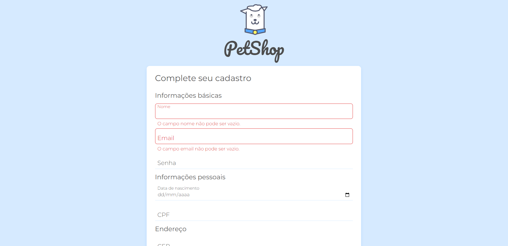

 <h1>Programa de Formação - Desenvolve 2023</h1>
 <h2>Doguito Petshop<h2>

---

## 💻 Sobre o Projeto

Este projeto consiste em uma aplicação web responsiva desenvolvida durante a etapa de de aprendizagem do Programa de Formação - Desenvolve 2023.
O <strong>Doguito Petshop</strong> é uma aplicação onde o foco está direcionado a validação básica do formulário de cadastro utilizando atributos que já existem dentro do próprio HTML, validações avançadas utilizando Javascript e também a utilização de requisições a uma API externa para o preenchimento automático do endereço ao colocar o CEP.
Projeto criado no curso JavaScript na Web: Validação de Formulários e HTML5, idealizada no ambito educacional, para o processo de aprendizagem das tecnologias em volvidades.

---

## ✅ Demonstração da aplicação

### 💻 Desktop

<h1 align="center">
  
</h1>

### 📱 Mobile

<h1 align="center">
  
</h1>

---

## 🛠️ Tecnologias Utilizadas

---

## ⚙️ Executando o projeto localmente (Linux ou Windows)

### Pré-requisitos

- Ter um navegador web instalado.
- Git.
- Recomendo ter o Visual Studio Code instalado.

### Instalação e execução

- Clone o repositório em um diretório de sua preferência
         
      git clone https://github.com/gleisonfernandes/aluramidi.git

- Abra o diretório do projeto
- Execute o arquivo index.html com o navegador.
- Caso na execução aconteça o bloqueado por “CORS”, utilizando Visual Studio Code, instale uma extensão chamada “live server”. Após instalada essa extensão, no canto inferior direito vai ter uma opção chamada “Go live”. Clicando nessa opção, ele vai abrir uma nova aba no navegador automaticamente sem o bloqueio e com tudo funcionando normalmente.

---

## 🚀 Estudante

|_Gleison Fernandes_|
|---|
||
|_Desenvolvedor_|
|    |